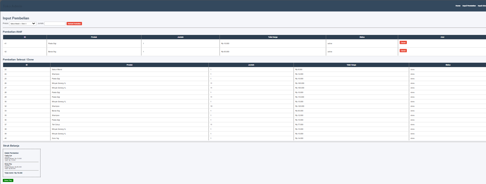
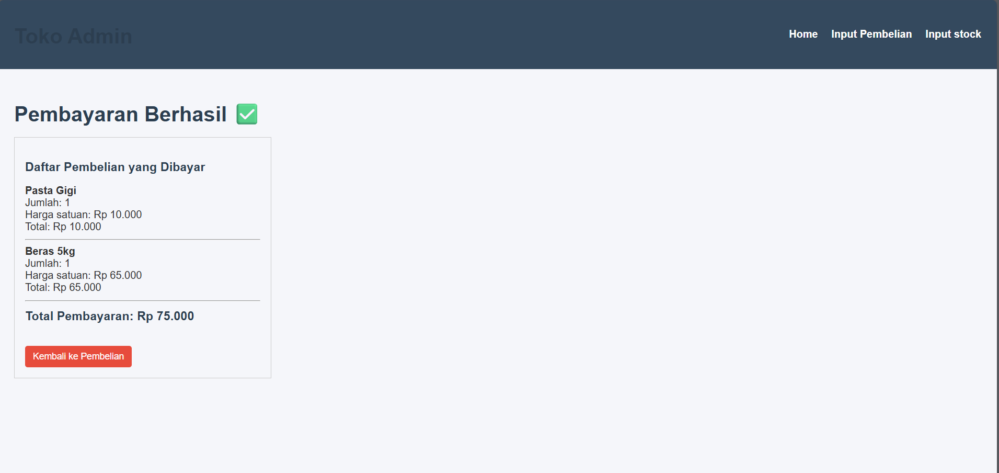
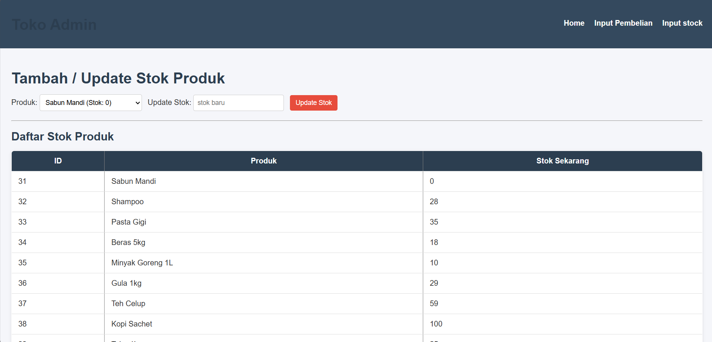

# EJS Toko Admin by Verry Kurniawan

Aplikasi manajemen toko sederhana berbasis web yang dibangun menggunakan Node.js, Express, EJS, dan MySQL.

## 📸 Tampilan Antarmuka (Screenshots)

Berikut adalah tampilan dari aplikasi:

### 1. Halaman Utama (Dashboard)


### 2. Input Pembelian



### 3. Payout / Pembayaran



### 4. Manajemen Stok



---

## 🛠️ Prasyarat

Sebelum memulai, pastikan Anda telah menginstal:

- [Node.js](https://nodejs.org/)
- [MySQL Database](https://www.mysql.com/)

## 🚀 Cara Instalasi

Ikuti langkah-langkah berikut untuk menjalankan proyek ini di komputer lokal Anda:

### 1. Clone Repository

Unduh source code proyek ini ke komputer Anda:

```bash
git clone https://github.com/princeofverry ejs-toko-admin.git

cd ejs-toko-admin
```

### 2. Install Dependencies

```bash
npm install
```

### 3. Konfigurasi Database

Buat database baru di MySQL (misalnya beri nama toko_db).

Buat file `.env` dan isi dengan informasi koneksi database Anda:

```bash
cp .env.example .env
```

### 4. Isi file `.env`

```bash
DB_HOST=
DB_USER=
DB_PASS=
DB_NAME=toko_admin
DB_DIALECT=mysql
PORT=3000
```

### 5. Jalankan Aplikasi

```bash
npm run seed
npm start
```

### 6. Akses Aplikasi

Buka browser dan temukan aplikasi di alamat `http://localhost:3000`.
